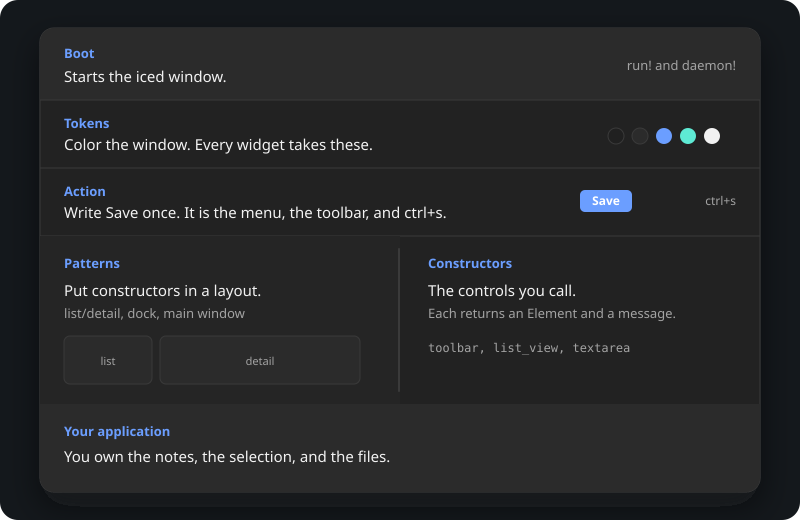

# Architecture

A window is a loop you write in Rust:

1. **Start it** (`Boot`, `run!`).
2. **Color it** (`Tokens`).
3. **Name the commands** (`ActionTable`).
4. **Draw controls** (constructors return `Element`s and send your
   messages).
5. **Arrange them** (patterns and layout).
6. **Keep the data in your program.** `update` changes that data when
   a message arrives. A database file, if you have one, is yours —
   icedtea does not write it.

## Start the window

[`Boot`](https://docs.rs/icedtea/latest/icedtea/app/struct.Boot.html)
sets title, application id, theme name, locale, density, and window
kind: application, dialog, or overlay.
[`run!`](https://docs.rs/icedtea/latest/icedtea/macro.run.html) loads
that and starts iced.
[`daemon!`](https://docs.rs/icedtea/latest/icedtea/macro.daemon.html)
uses the same [`Prepared`](https://docs.rs/icedtea/latest/icedtea/app/struct.Prepared.html)
settings when the process must stay up with no window mapped.
[`bootstrap`](https://docs.rs/icedtea/latest/icedtea/app/fn.bootstrap.html)
is that path without opening a window.

## Color it

[`theme::named`](https://docs.rs/icedtea/latest/icedtea/theme/fn.named.html)
and [`theme::mix`](https://docs.rs/icedtea/latest/icedtea/theme/fn.mix.html)
produce [`Tokens`](https://docs.rs/icedtea/latest/icedtea/theme/struct.Tokens.html).
Every constructor takes tokens. Persist defaults follow-OS on, so host
chrome layers onto the `light` / `dark` desktop pair. A named colorway
is a choice. Register more on `ThemeCatalog`. See [Theming](theming.md).

## Put commands in a table

An [`ActionTable`](https://docs.rs/icedtea/latest/icedtea/action/struct.ActionTable.html)
holds as many [`Action`](https://docs.rs/icedtea/latest/icedtea/action/struct.Action.html)s
as you insert. The table is what the menu bar, toolbar, shortcuts,
context menus, footer hints, and command palette read. Each Action is
declared once and carries your message. Write `ctrl+s` once: Command
on macOS, Control on Linux and Windows. See [Actions](actions.md).

## Call constructors

Functions in [`widget`](https://docs.rs/icedtea/latest/icedtea/widget/index.html)
return iced `Element`s and emit your messages. Each widget constructor
takes `A11y` and tokens. Chrome rows take an `ActionTable`. The
application owns the buffer, the selection, and the rest of the state.
`update` applies the message. See [Accessibility](accessibility.md).

## Move it

The application owns `iced::Animation` and the clock. Constructors
paint one frame from a 0–1 progress. See [Motion](motion.md).

## Arrange with patterns

[`pattern`](https://docs.rs/icedtea/latest/icedtea/pattern/index.html)
lays constructors out: `toolbar` and `status_bar` from the action
table, `list_detail` beside a filling pane, `main_window`.
[`layout`](https://docs.rs/icedtea/latest/icedtea/layout/index.html)
is the box recipes: `layout::dock`, `layout::split_view`,
`layout::clamp`, `layout::form`. See [Layout](layout.md).

An open modal consumes keys first. Otherwise a focused field owns
unmodified typing. Otherwise `key::handle` matches the action table.

[First window](first-window.md) is the smallest case of this compose.
[Keep a task list](cookbook/tasks.md) is the same loop with a list and
a SQLite file the application opens and writes.
The [reference](widgets.md) names every public constructor.
[Crate docs](https://docs.rs/icedtea) ·
[source](https://github.com/indynull/icedtea).
