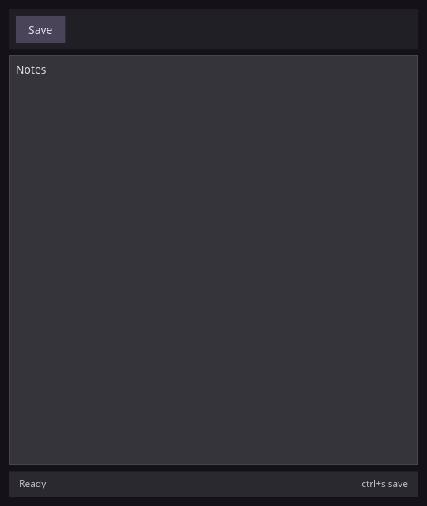

# First window

`icedtea::run!` starts the window. One `Action` feeds the toolbar.
`ctrl+s` or the Save row writes the buffer into the status line.

The program is [`examples/hello.rs`](https://github.com/indynull/icedtea/blob/master/examples/hello.rs)
in the repository. `cargo run --example hello`.



```rust
{{#include ../../examples/hello.rs}}
```

`Boot` loads tokens, locale, and window settings. `run!` (and
`daemon!`) call `typo::install_platform_faces` so UI text uses an
installed sans with normal and bold, and mono uses an installed fixed
face. Load a named family on the iced application if you want a
specific face.

A compact tool sets size on `Boot` (`.size(380.0, 560.0).min_size(...)`)
instead of calling iced window resize. See [Compact tools](compact-tools.md).

`bootstrap(&boot)` is the same path without opening a window — use it
in tests. An overlay that hides and pops out uses [`daemon!`](https://docs.rs/icedtea/latest/icedtea/macro.daemon.html)
plus [`Prepared::open`](https://docs.rs/icedtea/latest/icedtea/app/struct.Prepared.html).
Crate docs: [`run!`](https://docs.rs/icedtea/latest/icedtea/macro.run.html),
[`Boot`](https://docs.rs/icedtea/latest/icedtea/app/struct.Boot.html).
