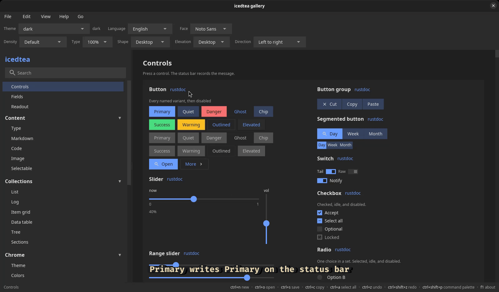

# icedtea

A Rust library that draws a native desktop window on
[iced](https://iced.rs/). Buttons, lists, menus, and the chrome around
them come from icedtea. Your program keeps the data (the notes, the
tasks, the file on disk). Paint follows
[Material Design 3](https://m3.material.io/) color roles
(`m3` module and `Tokens::scheme()`). Desktop chrome stays
rectangular (M3 shape None).

`icedtea::run!` opens the window. An `ActionTable` is the list of
commands you declare once; the toolbar, menus, shortcuts, context
menus, footer hints, and the command palette read that list. A
constructor is a function that draws one control and sends a
**message** — a note about what the user did. Color, layout, and
chrome are Rust values.

Click focuses a control. Tab walks those targets. A focused list,
tree, slider, or pick owns arrows, Enter, and Space. Escape closes
an open menu, pick, context menu, drawer, or cancel dialog.
`run!` listens. `ActionTable::seed_quit` adds `ctrl+q`. Lists,
tables, and trees virtualize. Markdown, code, and fields select and
copy through one `select` contract.

Read this book in layers:

1. [First window](first-window.md) is the shortest path: one `Action`,
   a toolbar, Tab into the editor, Save, and Quit.
2. [Architecture](architecture.md) is how Boot, tokens, the action
   table, constructors, keys, layout, and patterns fit. That page is
   the window contract.
3. [Keep a task list](cookbook/tasks.md) is the same loop with a list
   and a SQLite file. The [cookbook](cookbook/save.md) walks those
   jobs (save, list and detail, table, palette).
4. The [reference](widgets.md) lists every public constructor. Keys
   for that constructor sit on its page.

[Install](install.md) has the crate line and host libraries.

- [Crate docs](https://docs.rs/icedtea)
- [crates.io](https://crates.io/crates/icedtea)
- [Source](https://github.com/indynull/icedtea)
