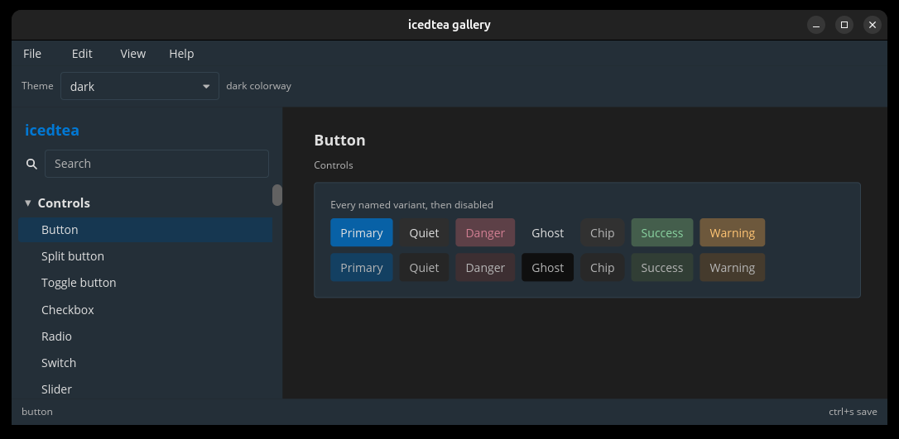

# icedtea

Native desktop widgets and chrome for [iced](https://iced.rs/).

`icedtea::run!` starts a themed window. Constructors return `Element`s
and emit your messages. Color, layout, and chrome are Rust values.



The [gallery](https://github.com/indynull/icedtea/tree/master/icedtea-gallery)
pages every `catalog::ENTRIES` id:

```bash
cargo run -p icedtea-gallery
```

[First window](first-window.md) is the shortest path. [Install](install.md)
has the crate line and host libraries. [Widgets](widgets.md) covers
constructors, time, and virtual lists.
