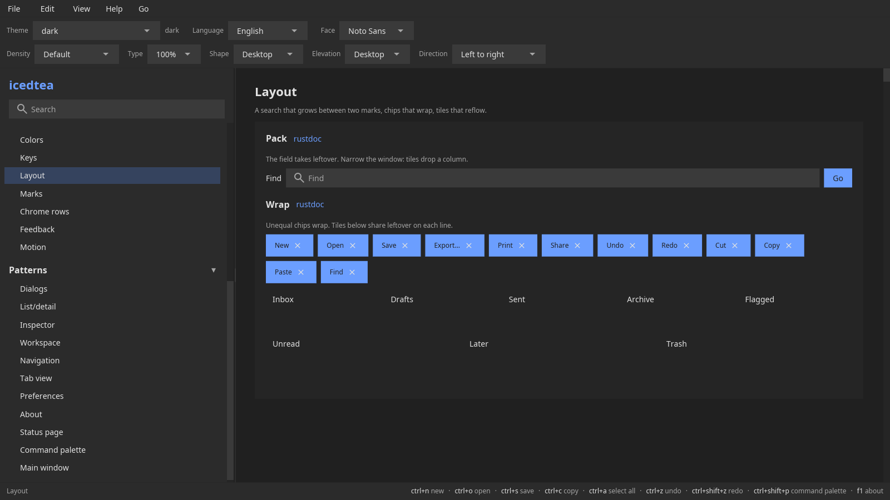

# Layout

Layout is Rust functions that return iced `Element`s. Recipes live in
[`icedtea::layout`](https://docs.rs/icedtea/latest/icedtea/layout/index.html):
`pack`, `wrap`, `dock`, `split_view`, `clamp`, `form`, `grid`, `pad`
(equal-fill tiles), `overlay_center`, plus size policy and
breakpoints.



`layout::pack` measures each child, then hugs or shares leftover on
one row or column. Pass [`Slot::hug`](https://docs.rs/icedtea/latest/icedtea/layout/struct.Slot.html)
and [`Slot::share`](https://docs.rs/icedtea/latest/icedtea/layout/struct.Slot.html).
[`Pack`](https://docs.rs/icedtea/latest/icedtea/layout/enum.Pack.html)
places leftover the stretch children do not take: start, end, center,
or between. `layout::wrap` is the same measurement, then a new line
when the next child does not fit. Do not pass a uniform child width
or the parent width. Window direction puts the first child on the
start edge. Share slots with a min width reflow a tile wall when the
parent crosses a column count.

`layout::pad(cells, 4, density.space)` shares row width across cells.
Pair it with `widget::button` and `Density::tile()` for a
key pad. Scroll a pane with `widget::scroll`.
`Breakpoint::from_width` picks the stacked or beside sidebar recipe.

`layout::FILL`, `layout::SHRINK`, and `layout::fixed(px)` are the size
language for boxes and editors. `BoxOpts` takes width and height. A
fill-height pack gives leftover to [`Slot::share`](https://docs.rs/icedtea/latest/icedtea/layout/struct.Slot.html)
children (a caption above a filling `textarea`).
`pattern::list_detail` takes the sidebar as that same size.
`split_view` and `list_detail` take `Direction`: the first pane is
left-to-right start (the right edge when the locale is Arabic or Urdu).

```rust,ignore
use icedtea::layout::{self, Axis, BoxOpts, Slot};

let panes = layout::pack(
    [Slot::share(source), Slot::share(preview)],
    BoxOpts {
        gap: 8.0,
        width: layout::FILL,
        height: layout::FILL,
        ..BoxOpts::new()
    },
    icedtea::i18n::Direction::Ltr,
);
let _ = layout::pack(
    [Slot::hug(caption), Slot::share(editor)],
    BoxOpts {
        axis: Axis::Vertical,
        gap: 4.0,
        padding: 8.0.into(),
        width: layout::FILL,
        height: layout::FILL,
        ..BoxOpts::new()
    },
    icedtea::i18n::Direction::Ltr,
);
let strip = layout::pack(
    [Slot::hug(mark), Slot::share(field), Slot::hug(go)],
    BoxOpts {
        gap: 8.0,
        ..BoxOpts::new()
    },
    icedtea::i18n::Direction::Ltr,
);
let _ = (panes, strip);
```

```rust
use icedtea::layout::{Breakpoint, SizePolicy, allocate};

let sizes = allocate(100.0, &[SizePolicy::fixed(20.0), SizePolicy::expand(1.0)]);
assert_eq!(sizes[0], 20.0);
let _ = Breakpoint::from_width(800.0);
```

Split ratios persist through `UiState::set_split`. `split_view` takes
`Tokens` and paints the 6 px sash as a hairline plus a short centered
handle. The sash grip emits press; while pressed, `listen_sash` feeds
window-space pointer move and release into `SashDrag::apply`.
`listen_cursor` is the same window pointer for a placed context menu.

`workspace::DockNode` is a nested leaf / split / tab tree with JSON
save and restore, ratio clamps, and `move_panel` between docks.
`pattern::workspace` paints that tree with splits, a sash, and tabs.
`pattern::drawer` is a compact side pane beside content; `progress` eases the pane width. `pattern::tool_panel` is title chrome
plus a Dock control. Perspectives are named `DockNode`
snapshots.

- [layout rustdoc](https://docs.rs/icedtea/latest/icedtea/layout/index.html)
- [source](https://github.com/indynull/icedtea/blob/main/src/layout/mod.rs)
- [crates.io](https://crates.io/crates/icedtea)
