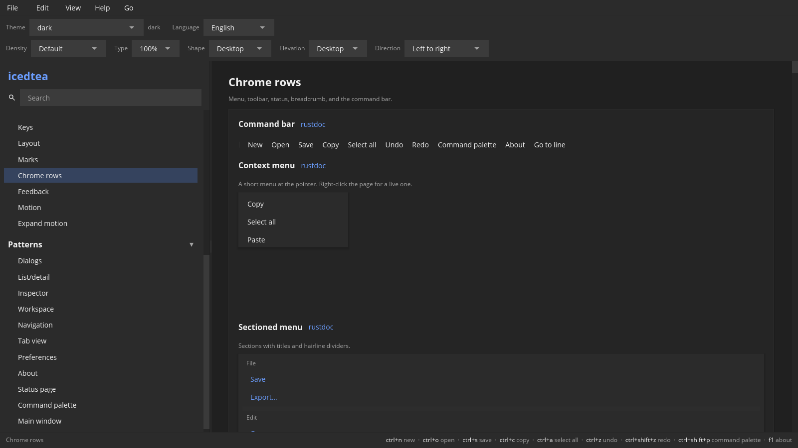

# Chrome

Theme, marks, rows, and feedback.
[rustdoc](https://docs.rs/icedtea) ·
[source](https://github.com/indynull/icedtea) ·
[icedtea](https://crates.io/crates/icedtea) ·
[iced](https://crates.io/crates/iced)

Widget constructors on this page take `A11y`. Menu, toolbar, status,
command bar, and cheatsheet take the action table. `layout::pack` and
`layout::wrap` do not. iced 0.14 publishes the widget id only.

### Theme

**`theme`** — Look up a built-in colorway by name.

Constructor: [`theme::named`](https://docs.rs/icedtea/latest/icedtea/theme/fn.named.html)

[source](https://github.com/indynull/icedtea/blob/main/src/theme.rs) ·
[icedtea](https://crates.io/crates/icedtea)

Unknown names resolve to `dark`, the desktop pair with `light`.
Persist defaults follow-OS on that pair. Register more on
`ThemeCatalog`. Density, type scale, corners, and elevation live on
`Tokens` (`with_density`, `with_font_scale`, `with_shape`,
`with_elevation`) and restore from `UiState::look`. See
[Theming](../theming.md).

### Colors

**`colors`** — Blend two colors for washes.

Constructor: [`theme::mix`](https://docs.rs/icedtea/latest/icedtea/theme/fn.mix.html)

[source](https://github.com/indynull/icedtea/blob/main/src/theme.rs) ·
[icedtea](https://crates.io/crates/icedtea)

`amount` 0 is the background, 1 is the foreground. Hover, pressed,
and selection washes use this.

### Keys

**`keys`** — Resolve a key event against the action table.

Constructor: [`key::handle`](https://docs.rs/icedtea/latest/icedtea/key/fn.handle.html)

[source](https://github.com/indynull/icedtea/blob/main/src/key.rs) ·
[icedtea](https://crates.io/crates/icedtea)

Subscribe with [`key::listen`](https://docs.rs/icedtea/latest/icedtea/key/fn.listen.html).
An open modal consumes. Focused text owns unmodified typing.
Otherwise chords match the table. See [Actions](../actions.md).

### Cheatsheet

**`cheatsheet`** — A searchable shortcut list from the action table.

Constructor: [`pattern::cheatsheet`](https://docs.rs/icedtea/latest/icedtea/pattern/fn.cheatsheet.html)

[source](https://github.com/indynull/icedtea/blob/main/src/pattern.rs) ·
[icedtea](https://crates.io/crates/icedtea)

Empty query lists every enabled action. Disabled actions stay out.

### Card

**`card`** — A titled panel around children.

Constructor: [`widget::group_box`](https://docs.rs/icedtea/latest/icedtea/widget/fn.group_box.html)

[source](https://github.com/indynull/icedtea/blob/main/src/widget.rs) ·
[icedtea](https://crates.io/crates/icedtea)

Same constructor as group-box. `CardFace` is elevated, filled,
outlined, or rail (inset start rail and a label gutter). An optional
trailing child sits on the header end. Empty title is a border only.

Pass `A11y`.

### Rule

**`rule`** — A horizontal divider.

Constructor: [`widget::rule_h`](https://docs.rs/icedtea/latest/icedtea/widget/fn.rule_h.html)

[source](https://github.com/indynull/icedtea/blob/main/src/widget.rs) ·
[icedtea](https://crates.io/crates/icedtea) ·
[iced](https://crates.io/crates/iced)

`rule_v` is the vertical twin.

Pass `A11y`.

### Chip

**`chip`** — A compact labeled pill.

Constructor: [`widget::chip`](https://docs.rs/icedtea/latest/icedtea/widget/fn.chip.html)

[source](https://github.com/indynull/icedtea/blob/main/src/widget.rs) ·
[icedtea](https://crates.io/crates/icedtea)

`ChipKind` is assist, filter, input, or suggestion. Optional icon,
press, and dismiss. META type, chip wash, shrink width. Disabled keeps
the face and drops press.

Pass `A11y`.

### Badge

**`badge`** — A count or status mark.

Constructor: [`widget::badge`](https://docs.rs/icedtea/latest/icedtea/widget/fn.badge.html)

[source](https://github.com/indynull/icedtea/blob/main/src/widget.rs) ·
[icedtea](https://crates.io/crates/icedtea)

`BadgeSize` is small or large. Both use meta type. Corners follow
`Tokens.shape`. Pass a host element to overlap the mark on an icon.
Empty string is an empty mark.

Pass `A11y`.

### Pack

**`pack`** — Measure children and allocate leftover on one row or column.

Constructor: [`layout::pack`](https://docs.rs/icedtea/latest/icedtea/layout/fn.pack.html)

[source](https://github.com/indynull/icedtea/blob/main/src/layout/flow.rs) ·
[icedtea](https://crates.io/crates/icedtea)

Pass `Slot::hug` and `Slot::share`. `Pack` places leftover stretch
does not take (start, end, center, between). Empty slots yield an
empty box. Direction mirrors a horizontal box.

### Wrap

**`wrap`** — Measure children and start a new line when the next does not fit.

Constructor: [`layout::wrap`](https://docs.rs/icedtea/latest/icedtea/layout/fn.wrap.html)

[source](https://github.com/indynull/icedtea/blob/main/src/layout/flow.rs) ·
[icedtea](https://crates.io/crates/icedtea)

Pass slots, gap, and direction. Do not pass a uniform child width or
the parent width. Empty slots yield an empty box. Share slots with a
min width reflow how many sit on a line.

### Banner

**`banner`** — A page-level message with an optional action.

Constructor: [`widget::banner`](https://docs.rs/icedtea/latest/icedtea/widget/fn.banner.html)

[source](https://github.com/indynull/icedtea/blob/main/src/widget.rs) ·
[icedtea](https://crates.io/crates/icedtea)

Use for “offline” or “update available”. Optional button message.

Pass `A11y`.

### Command bar

**`command-bar`** — The toolbar row, denser.

Constructor: [`pattern::command_bar`](https://docs.rs/icedtea/latest/icedtea/pattern/fn.command_bar.html)

[source](https://github.com/indynull/icedtea/blob/main/src/pattern.rs) ·
[icedtea](https://crates.io/crates/icedtea)

Same `Action` iterator as `toolbar`. Disabled actions paint muted.

### Context menu

**`context-menu`** — Action list under the pointer.

Constructor: [`pattern::context_menu`](https://docs.rs/icedtea/latest/icedtea/pattern/fn.context_menu.html)

[source](https://github.com/indynull/icedtea/blob/main/src/pattern.rs) ·
[icedtea](https://crates.io/crates/icedtea)

Stack on the window with the click point. Click-away dismisses.
Rows fill the card. Empty table still paints a card. `progress` is
0 (gone) to 1 (rest).

### Breadcrumb

**`breadcrumb`** — A path of links.

Constructor: [`widget::breadcrumb`](https://docs.rs/icedtea/latest/icedtea/widget/fn.breadcrumb.html)

[source](https://github.com/indynull/icedtea/blob/main/src/widget.rs) ·
[icedtea](https://crates.io/crates/icedtea)

Crumbs before the last send a message. The last crumb is the current
page. Empty path is empty.

Pass `A11y`.

### Menu

**`menu`** — An in-window menu bar from one action table.

Constructor: [`pattern::menu_bar`](https://docs.rs/icedtea/latest/icedtea/pattern/fn.menu_bar.html)

[source](https://github.com/indynull/icedtea/blob/main/src/pattern.rs) ·
[icedtea](https://crates.io/crates/icedtea)

Groups by the id prefix before `.` (`file.save` → File). Disabled
actions stay out of the pick list.

### Toolbar

**`toolbar`** — A row of action buttons.

Constructor: [`pattern::toolbar`](https://docs.rs/icedtea/latest/icedtea/pattern/fn.toolbar.html)

[source](https://github.com/indynull/icedtea/blob/main/src/pattern.rs) ·
[icedtea](https://crates.io/crates/icedtea)

[First window](../first-window.md) uses this with `file.save`.
Direction comes from `Boot`.

### Status bar

**`status-bar`** — Footer text plus shortcut hints from the table.

Constructor: [`pattern::status_bar`](https://docs.rs/icedtea/latest/icedtea/pattern/fn.status_bar.html)

[source](https://github.com/indynull/icedtea/blob/main/src/pattern.rs) ·
[icedtea](https://crates.io/crates/icedtea)

Left is status copy (`meta`, or `info_bar` when a tone is set). Right
is each enabled shortcut as two faces (chord in `Tokens.text`, title
in `Tokens.muted` at meta size), or an optional caption string. An
empty table shows status only. `ActionTable::footer_hints` returns
the joined strings (`j down`) for tests.

### Scrollbar

**`scrollbar`** — A themed scroller with a usable handle.

Constructor: [`widget::scroll`](https://docs.rs/icedtea/latest/icedtea/widget/fn.scroll.html)

[source](https://github.com/indynull/icedtea/blob/main/src/widget.rs) ·
[icedtea](https://crates.io/crates/icedtea) ·
[iced](https://crates.io/crates/iced)

Lists and tables use a 24px rail. The rail sits on the end side
(`Tokens.direction`: right in left-to-right, left in right-to-left).
This constructor is the themed
iced scroller for other panes.

Pass `A11y`.

### Toast

**`toast`** — A transient notice.

Constructor: [`widget::toast_view`](https://docs.rs/icedtea/latest/icedtea/widget/fn.toast_view.html)

[source](https://github.com/indynull/icedtea/blob/main/src/widget.rs) ·
[icedtea](https://crates.io/crates/icedtea) ·
[iced](https://crates.io/crates/iced)

The application owns the `Toast` queue and dismiss. Empty queue
paints nothing. Enter and the last slice of TTL fade through
`motion::overlay`.

Pass `A11y`.

### Busy overlay

**`busy`** — Dim plus spinner over a child.

Constructor: [`widget::busy_overlay`](https://docs.rs/icedtea/latest/icedtea/widget/fn.busy_overlay.html)

[source](https://github.com/indynull/icedtea/blob/main/src/widget.rs) ·
[icedtea](https://crates.io/crates/icedtea)

When `busy` is false the child is unmodified. Advance spinner
`phase` while true.

Pass `A11y`.

### Motion

**`motion`** — Fade and slide a child for overlay enter/exit.

Constructor: [`motion::overlay`](https://docs.rs/icedtea/latest/icedtea/motion/fn.overlay.html)

[source](https://github.com/indynull/icedtea/blob/main/src/motion.rs) ·
[icedtea](https://crates.io/crates/icedtea)

`progress` is 0 (gone) to 1 (rest). The application owns
`iced::Animation` and passes `interpolate(0.0, 1.0, now)`.
`Slide::None` is fade only: build the child with `Tokens::fade`.
Reduced-motion tokens snap to 0 or 1. Duration and easing live in
`m3::motion`. `bounce_out`, `pulse`, and `shake` are curves you
sample like `Ease`; see [Motion](../motion.md).

Pass `A11y`.

### Expand motion

**`expand-motion`** — Clip a child between a peek height and its open
height.

Constructor: [`motion::expand`](https://docs.rs/icedtea/latest/icedtea/motion/fn.expand.html)

[source](https://github.com/indynull/icedtea/blob/main/src/motion.rs) ·
[icedtea](https://crates.io/crates/icedtea)

Expander and accordion paint through this. `progress` 0 is the peek;
1 is the laid-out height.

Pass `A11y`.

### Filter chips

**`filter-chips`** — Multi-select filter chip set.

Constructor: [`widget::filter_chips`](https://docs.rs/icedtea/latest/icedtea/widget/fn.filter_chips.html)

[source](https://github.com/indynull/icedtea/blob/main/src/widget.rs) ·
[icedtea](https://crates.io/crates/icedtea) ·
[iced](https://crates.io/crates/iced)

The application owns which indices are on. Press toggles one chip.

Pass `A11y`.

### Sectioned menu

**`sectioned-menu`** — Menu list with optional section titles and dividers.

Constructor: [`pattern::sectioned_menu`](https://docs.rs/icedtea/latest/icedtea/pattern/fn.sectioned_menu.html)

[source](https://github.com/indynull/icedtea/blob/main/src/pattern.rs) ·
[icedtea](https://crates.io/crates/icedtea) ·
[iced](https://crates.io/crates/iced)

Pass [`MenuSection`](https://docs.rs/icedtea/latest/icedtea/pattern/struct.MenuSection.html) groups of actions.

Pass `A11y`.

### Cascade menu

**`cascade-menu`** — Two-level menu with an optional open submenu.

Constructor: [`pattern::cascade_menu`](https://docs.rs/icedtea/latest/icedtea/pattern/fn.cascade_menu.html)

[source](https://github.com/indynull/icedtea/blob/main/src/pattern.rs) ·
[icedtea](https://crates.io/crates/icedtea) ·
[iced](https://crates.io/crates/iced)

The application owns which primary row is expanded. `sub_progress`
is 0 (gone) to 1 (rest) for that panel.

Pass `A11y`.

