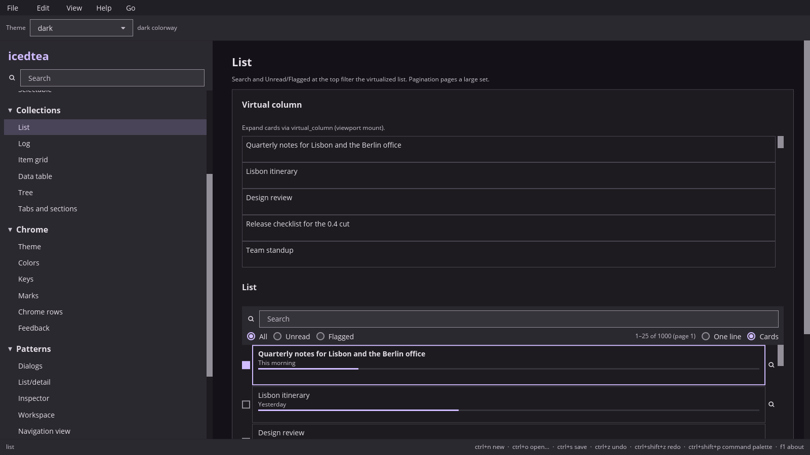

# Collections

Lists, tables, trees, tabs, expanders, and pages.
[rustdoc](https://docs.rs/icedtea/latest/icedtea/widget/index.html) ·
[source](https://github.com/indynull/icedtea/blob/master/src/widget.rs) ·
[icedtea](https://crates.io/crates/icedtea) ·
[iced](https://crates.io/crates/iced)

`VisibleWindow.scroll` is the only list and table offset. The rail and
the wheel write it. Variable-height rows use `row_offsets` /
`visible_range_var`. `scroll_id` names the list clip pane.

### List

**`list`** — A virtualized row list.

Constructor: [`widget::list_view`](https://docs.rs/icedtea/latest/icedtea/widget/fn.list_view.html)

[source](https://github.com/indynull/icedtea/blob/master/src/widget.rs) ·
[icedtea](https://crates.io/crates/icedtea)

`empty` is the copy when the model has no rows. Selection stays on
indices. Disabled drops row messages. `on_scroll` reports the window
after a wheel or rail move. Pass `RowHeights::PerRow` for variable
row heights (`visible_range_var`). `RowFace::Flush` is one clipped
line. `RowFace::Card` is a surface, wrapped title, and an optional
3px meter. `ListModel::leading` / `trailing` paint `RowSlot::Icon` or
`RowSlot::Check` on the same virtualized rows. `on_check` toggles a
check slot.

### Virtual column

**`virtual-column`** — Virtualized free-form rows with known heights.

Constructor: [`widget::virtual_column`](https://docs.rs/icedtea/latest/icedtea/widget/fn.virtual_column.html)

[source](https://github.com/indynull/icedtea/blob/master/src/widget.rs) ·
[icedtea](https://crates.io/crates/icedtea)

Same windowing as list (overscan, rail, wheel) for app-built faces —
expand cards, custom bodies. Build heights with
`collection::expand_card_heights` (closed estimate plus open-row
heights). Title/meta model lists stay on `list_view`.

### Log

**`log`** — Append-only lines that stick to the end.

Constructor: [`widget::log_view`](https://docs.rs/icedtea/latest/icedtea/widget/fn.log_view.html)

[source](https://github.com/indynull/icedtea/blob/master/src/widget.rs) ·
[icedtea](https://crates.io/crates/icedtea)

Virtualizes long logs. Iced's end anchor reports offset 0, so the log
reads the reversed offset and mounts the tail. Empty lines show
“No lines”.

### Item grid

**`grid`** — Tiles that share the row width.

Constructor: [`widget::item_grid`](https://docs.rs/icedtea/latest/icedtea/widget/fn.item_grid.html)

[source](https://github.com/indynull/icedtea/blob/master/src/widget.rs) ·
[icedtea](https://crates.io/crates/icedtea)

Pass titles. Click sends the index. Empty grid is an empty column.

### Data table

**`table`** — A virtualized table. Last column fills.

Constructor: [`widget::data_table`](https://docs.rs/icedtea/latest/icedtea/widget/fn.data_table.html)

[source](https://github.com/indynull/icedtea/blob/master/src/widget.rs) ·
[icedtea](https://crates.io/crates/icedtea)

`TableModel` holds headers and rows. `on_cell` is (row, column).
`on_sort` is the header click. `ColumnLayout` order is scroll order;
`frozen` keeps the first *n* columns in view. `on_h_scroll` moves
the rest. `TableSource::row_checked` plus `on_check` paint a leading
checkbox column. Empty rows still paint headers.

### Tree

**`tree`** — An expandable outline.

Constructor: [`widget::tree_view`](https://docs.rs/icedtea/latest/icedtea/widget/fn.tree_view.html)

[source](https://github.com/indynull/icedtea/blob/master/src/widget.rs) ·
[icedtea](https://crates.io/crates/icedtea)

The application owns expand state. Leaf rows have no twisty. Empty
tree is an empty column.

### Tabs

**`tabs`** — A tab bar over a body the application paints.

Constructor: [`widget::tab_bar`](https://docs.rs/icedtea/latest/icedtea/widget/fn.tab_bar.html)

[source](https://github.com/indynull/icedtea/blob/master/src/widget.rs) ·
[icedtea](https://crates.io/crates/icedtea)

`Tabs { closable: false }` is pinned sections. `with_badge` paints a
count on a tab. `with_icon` paints icon-plus-text. `tab_bar` takes
`secondary` for a 1 dp underbar (3 dp when false). When `max_width`
is set and titles do not fit, extra tabs move into a More list. Select
sends the index. See also
[`pattern::tab_view`](patterns.md#tab-view).

### Accordion

**`accordion`** — An open row shows a body under the header.

Constructor: [`widget::accordion_view`](https://docs.rs/icedtea/latest/icedtea/widget/fn.accordion_view.html)

[source](https://github.com/indynull/icedtea/blob/master/src/widget.rs) ·
[icedtea](https://crates.io/crates/icedtea)

The application owns which row is open. Closed rows are headers
only. The chevron sits on the trailing edge.

### Expander

**`expander`** — A card that clips its child until the header opens it.

Constructor: [`widget::expander`](https://docs.rs/icedtea/latest/icedtea/widget/fn.expander.html)

[source](https://github.com/indynull/icedtea/blob/master/src/widget.rs) ·
[icedtea](https://crates.io/crates/icedtea)

The application owns `open`. Closed shows a `Peek` of the child
(pixels, or whole body lines with room for the last descent) and
fades the cut. Open paints the full child. Title starts; the
chevron sits on the trailing edge. Accordion is many headers;
this is one card.

### Pagination

**`pagination`** — Page through a long list.

Constructor: [`widget::pagination`](https://docs.rs/icedtea/latest/icedtea/widget/fn.pagination.html)

[source](https://github.com/indynull/icedtea/blob/master/src/widget.rs) ·
[icedtea](https://crates.io/crates/icedtea)

Pass page count and the current page. Messages are previous, next,
and jump. One page hides the control or disables the arrows.
