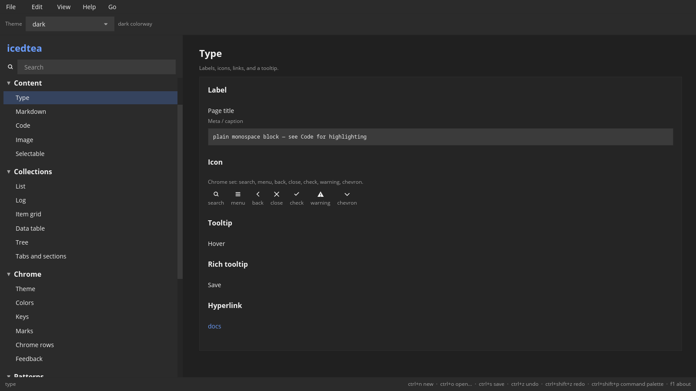

# Content

Type, icons, documents, and images.
[rustdoc](https://docs.rs/icedtea/latest/icedtea/widget/index.html) ·
[source](https://github.com/indynull/icedtea/blob/master/src/widget.rs) ·
[icedtea](https://crates.io/crates/icedtea) ·
[iced](https://crates.io/crates/iced)

Each constructor takes `A11y` unless noted. iced 0.14 publishes the widget id only.

## Select and copy

Readable body, code, and markdown share one contract (module
[`select`](https://docs.rs/icedtea/latest/icedtea/select/index.html)):
drag a contiguous range of **visible** text, then host copy (Ctrl+C /
Cmd+C or `icedtea::copy_text`). Typing does not apply on these
surfaces.

| Surface | Who owns the text | Range copy | Select all / full |
| --- | --- | --- | --- |
| [`selectable`](#selectable), code | App `text_editor::Content` via `select_only` | `Content::selection()` → `copy_text` | `Action::SelectAll` / whole buffer |
| [`markdown`](#markdown) | Paint-side document (layout stays real) | `MarkdownSpan` → `copy_text` | `markdown_select_all` / `doc.source` |

Labeled values use the same editor path under [Fields](fields.md#value-field)
and `field::Selectables`. Chrome (menus, buttons, status meta) is not
drag-selectable. Drag across headings, paragraphs, and lists uses
`select::markdown_select` and `MarkdownSpan::text`.

### Label

**`label`** — A line of body text.

Constructor: [`widget::label`](https://docs.rs/icedtea/latest/icedtea/widget/fn.label.html)

[source](https://github.com/indynull/icedtea/blob/master/src/widget.rs) ·
[icedtea](https://crates.io/crates/icedtea)

Platform sans. Empty string is an empty node; still pass `A11y`.

### Icon

**`icon`** — A chrome SVG from the bundled set.

Constructor: [`widget::icon_svg`](https://docs.rs/icedtea/latest/icedtea/widget/fn.icon_svg.html)

[source](https://github.com/indynull/icedtea/blob/master/src/widget.rs) ·
[icedtea](https://crates.io/crates/icedtea)

Chrome set only (`Icon::Search`, `Close`, and the rest). Tokens tint
the fill.

Pass `A11y`.

### Tooltip

**`tooltip`** — Hover text on a child.

Constructor: [`widget::tooltip_wrap`](https://docs.rs/icedtea/latest/icedtea/widget/fn.tooltip_wrap.html)

[source](https://github.com/indynull/icedtea/blob/master/src/widget.rs) ·
[icedtea](https://crates.io/crates/icedtea) ·
[iced](https://crates.io/crates/iced)

`TooltipAnchor` picks follow-cursor, top, bottom, or start. Empty tip
text is a no-op wrap. The child keeps its own `A11y`.

### Rich tooltip

**`rich-tooltip`** — Hover title plus supporting copy.

Constructor: [`widget::tooltip_rich`](https://docs.rs/icedtea/latest/icedtea/widget/fn.tooltip_rich.html)

[source](https://github.com/indynull/icedtea/blob/master/src/widget.rs) ·
[icedtea](https://crates.io/crates/icedtea)

Optional action button and `TooltipAnchor`. Empty title, body, and
action is a no-op wrap. The child keeps its own `A11y`.

### Hyperlink

**`link`** — A text link that sends a message.

Constructor: [`widget::hyperlink`](https://docs.rs/icedtea/latest/icedtea/widget/fn.hyperlink.html)

[source](https://github.com/indynull/icedtea/blob/master/src/widget.rs) ·
[icedtea](https://crates.io/crates/icedtea)

The application opens the URL or navigates. Disabled paints muted
text and drops the press.

Pass `A11y`.

### Markdown

**`markdown`** — A parsed document.

Constructor: [`widget::markdown_view`](https://docs.rs/icedtea/latest/icedtea/widget/fn.markdown_view.html)

[source](https://github.com/indynull/icedtea/blob/master/src/widget.rs) ·
[icedtea](https://crates.io/crates/icedtea) ·
[iced](https://crates.io/crates/iced)

Parse with `MarkdownDoc::parse`, then view the items. Truncate by
slicing the source before parse. Body is `typo::BODY`; H1 is
`typo::PAGE` (same step as a window title). Links and inline code use
`Tokens::scheme()` (`primary`, `on_surface`, `surface_container_high`).
Real markdown layout (headings, lists, code frames). Drag a range
with `select::markdown_select` (X and Y; a same-line drag is a
range). A double-click selects the word under the caret. Pointer
events reach `markdown_select` first so the painted highlight and
Copy are that span. Copy is the span only. Select all is
`markdown_select_all`. The whole source is a separate Copy-all
path (`doc.source`).

Pass `A11y`.

### Code

**`code`** — Highlighted source.

Constructor: [`widget::highlighted_code`](https://docs.rs/icedtea/latest/icedtea/widget/fn.highlighted_code.html)

[source](https://github.com/indynull/icedtea/blob/master/src/widget.rs) ·
[icedtea](https://crates.io/crates/icedtea) ·
[iced](https://crates.io/crates/iced)

The application owns the buffer and the language name. Highlighter
face follows the active colorway (`theme::code_highlight`). Typing
does not change the buffer. Select and copy like `selectable`.

Pass `A11y`.

### Image

**`image`** — A slot that keeps its box.

Constructor: [`widget::image_slot`](https://docs.rs/icedtea/latest/icedtea/widget/fn.image_slot.html)

[source](https://github.com/indynull/icedtea/blob/master/src/widget.rs) ·
[icedtea](https://crates.io/crates/icedtea) ·
[iced](https://crates.io/crates/iced)

Ready keeps the requested width and height. Missing bytes show the
empty slot, not a collapsed layout.

Pass `A11y`.

### Selectable

**`selectable`** — Body the user can drag-select and copy.

Constructor: [`widget::selectable`](https://docs.rs/icedtea/latest/icedtea/widget/fn.selectable.html)

[source](https://github.com/indynull/icedtea/blob/master/src/widget.rs) ·
[icedtea](https://crates.io/crates/icedtea) ·
[iced](https://crates.io/crates/iced)

Looks like body text. The application owns `text_editor::Content` and
posts `Content::selection()` with `icedtea::copy_text`. `FontFace::Ui`
is prose; `FontFace::Mono` is a path or raw value. Disabled still
allows select-and-copy.

Pass `A11y`.

