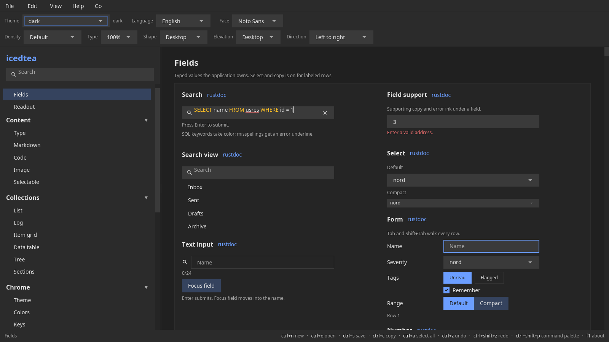

# Fields

Text, numbers, dates, and picks.
[rustdoc](https://docs.rs/icedtea/latest/icedtea/widget/index.html) ·
[source](https://github.com/indynull/icedtea/blob/main/src/widget.rs) ·
[icedtea](https://crates.io/crates/icedtea) ·
[iced](https://crates.io/crates/iced)

Each constructor takes `A11y` unless noted. iced 0.14 publishes the widget id only.

### Text input

**`text-input`** — A single-line editor.

Constructor: [`widget::text_input`](https://docs.rs/icedtea/latest/icedtea/widget/fn.text_input.html)

[source](https://github.com/indynull/icedtea/blob/main/src/widget.rs) ·
[icedtea](https://crates.io/crates/icedtea) ·
[iced](https://crates.io/crates/iced)

`FieldOpts` picks filled or outlined, prefix/suffix icons, a floating
label when the value is non-empty, an optional character count, and
a highlighter: `highlight` is byte ranges plus a `FieldInk` role
(`text`, `success`, `warning`, `muted`, `error`). `error` keeps body
ink and draws a danger underline (spelling). The application owns
the matcher (this handbook's search demo uses SQL); the field paints
those runs on the typed value. Optional iced `Id` so you can `focus`
after show. Disabled greys the field and drops edit. Empty value is
a valid state.

Pass `A11y`.

### Password

**`password`** — A masked single-line editor.

Constructor: [`widget::password_input`](https://docs.rs/icedtea/latest/icedtea/widget/fn.password_input.html)

[source](https://github.com/indynull/icedtea/blob/main/src/widget.rs) ·
[icedtea](https://crates.io/crates/icedtea) ·
[iced](https://crates.io/crates/iced)

Characters paint as dots. The application owns the string. Disabled
drops edit.

Pass `A11y`.

### Secret field

**`secret`** — A settings row: masked field, reveal, and copy.

Constructor: [`widget::secret_field`](https://docs.rs/icedtea/latest/icedtea/widget/fn.secret_field.html)

[source](https://github.com/indynull/icedtea/blob/main/src/widget.rs) ·
[icedtea](https://crates.io/crates/icedtea)

Reveal toggles the mask. Copy is an `Action` whose message the
application handles with `icedtea::copy_text`.

Pass `A11y`.

### Value field

**`value-field`** — A labeled read-only value the user can select and copy.

Constructor: [`widget::value_field`](https://docs.rs/icedtea/latest/icedtea/widget/fn.value_field.html)

[source](https://github.com/indynull/icedtea/blob/main/src/widget.rs) ·
[icedtea](https://crates.io/crates/icedtea)

Meta label in a fixed gutter, selectable value (fill), optional Copy
`Action`. Pass `layout::FORM_LABEL` (140px, same as `layout::form`) so
stacked rows align; pass another width when the stack needs a wider
gutter. Bind the text with `field::Selectables` (`get` is `Option`,
unbound `perform` is a no-op). Mono face for paths and ids. Same
select-and-copy contract as body and code: app-owned buffer,
`select_only`, range via `Content::selection()` and
`icedtea::copy_text`. See
[Content: Select and copy](content.md#select-and-copy) and
[`select`](https://docs.rs/icedtea/latest/icedtea/select/index.html).

Pass `A11y`.

### Text area

**`textarea`** — A multi-line editor.

Constructor: [`widget::textarea`](https://docs.rs/icedtea/latest/icedtea/widget/fn.textarea.html)

[source](https://github.com/indynull/icedtea/blob/main/src/widget.rs) ·
[icedtea](https://crates.io/crates/icedtea) ·
[iced](https://crates.io/crates/iced)

Height is `layout::FILL` or `layout::fixed`. The application owns the
`text_editor::Content`. Disabled drops edit.

Pass `A11y`.

### Search

**`search`** — A query field with a search icon.

Constructor: [`widget::search_input`](https://docs.rs/icedtea/latest/icedtea/widget/fn.search_input.html)

[source](https://github.com/indynull/icedtea/blob/main/src/widget.rs) ·
[icedtea](https://crates.io/crates/icedtea) ·
[iced](https://crates.io/crates/iced)

Use for palette and list filters. Empty query means “show all”.
One Search-radius bar at control height: leading glass, value, and
optional clear sit inside that face. The placeholder is the a11y
name. Pass submit for Enter and an input id when the application
must focus the field. Pass `highlight` to run a syntax highlighter
on the typed query (`FieldRun` slices, same roles as `FieldOpts`).
The application owns the matcher. Pass `on_clear` for the trailing
clear mark; it paints only when the value is non-empty.

Pass `A11y`.

### Search view

**`search-view`** — Docked results under a search field.

Constructor: [`widget::search_view`](https://docs.rs/icedtea/latest/icedtea/widget/fn.search_view.html)

[source](https://github.com/indynull/icedtea/blob/main/src/widget.rs) ·
[icedtea](https://crates.io/crates/icedtea)

The application owns the query and the hit list. Empty hits show
`empty`. Disabled drops pick and clear.
Arrows move the highlighted hit while the query field is focused.

Pass `A11y`.

### Suggest

**`suggest`** — A text field with a pick list of completions.

Constructor: [`widget::suggest_field`](https://docs.rs/icedtea/latest/icedtea/widget/fn.suggest_field.html)

[source](https://github.com/indynull/icedtea/blob/main/src/widget.rs) ·
[icedtea](https://crates.io/crates/icedtea)

The application owns the query and the suggestion list. Picking a
row writes that string.

Pass `A11y`.

### Select

**`select`** — Pick one string from a list.

Constructor: [`widget::pick_list`](https://docs.rs/icedtea/latest/icedtea/widget/fn.pick_list.html)

[source](https://github.com/indynull/icedtea/blob/main/src/widget.rs) ·
[icedtea](https://crates.io/crates/icedtea) ·
[iced](https://crates.io/crates/iced)

`ControlSize` picks the face. Compact uses tight pad and meta type
so a toolbar can nest a dropdown. Default keeps the field body look.
The trailing mark is Material `arrow_drop_down`: 24 dp (20 dp
Compact), inset `Density::inset` from the end. A press on the mark
opens the menu. Right-to-left puts the mark on the physical left.
Placeholder shows when nothing is selected. Disabled keeps the
current face.
Enter and Space open the overlay. Arrows move the selection while
the control is focused.

Pass `A11y`.

### Form

**`form`** — A labeled field group that owns Tab.

Constructor: [`widget::form_group`](https://docs.rs/icedtea/latest/icedtea/widget/fn.form_group.html)

[source](https://github.com/indynull/icedtea/blob/main/src/widget.rs) ·
[icedtea](https://crates.io/crates/icedtea)

Tab and Shift+Tab walk the rows and wrap. The first text field can
take iced focus on mount when that row is `active` and carries an
`Id`. Space activates the focused non-text row. An empty row title
leaves the label column blank. Pick lists, chips, checkboxes,
radios, and segmented buttons sit in the same order.
`layout::form` only stacks the pairs. The application owns values,
messages, and `active`.

Pass `A11y`.

### Number

**`number`** — Edit a numeric value with step buttons.

Constructor: [`widget::number_input`](https://docs.rs/icedtea/latest/icedtea/widget/fn.number_input.html)

[source](https://github.com/indynull/icedtea/blob/main/src/widget.rs) ·
[icedtea](https://crates.io/crates/icedtea)

The application owns the number. Step messages bump it. Disabled
freezes the value.
Arrows step the value when the field is focused.

Pass `A11y`.

### Date

**`date`** — Pick a calendar date.

Constructor: [`widget::date_stepper`](https://docs.rs/icedtea/latest/icedtea/widget/fn.date_stepper.html)

[source](https://github.com/indynull/icedtea/blob/main/src/widget.rs) ·
[icedtea](https://crates.io/crates/icedtea)

The application owns the selected day. Disabled ignores picks.
Arrows step the day when the control is focused.

Pass `A11y`.

### Time

**`time`** — Step hour, minute, second, or period on a 24-hour value.

Constructor: [`widget::time_picker`](https://docs.rs/icedtea/latest/icedtea/widget/fn.time_picker.html)

[source](https://github.com/indynull/icedtea/blob/main/src/widget.rs) ·
[icedtea](https://crates.io/crates/icedtea)

`TimeValue` is hour, minute, second. `TimeClock` is display only
(12-hour or 24-hour, optional seconds). `TimeField` is the unit that
steps. Disabled freezes the fields.
Arrows step the focused unit.

Pass `A11y`.

### Field support

**`field-support`** — Supporting or error text under a field.

Constructor: [`widget::field_support`](https://docs.rs/icedtea/latest/icedtea/widget/fn.field_support.html)

[source](https://github.com/indynull/icedtea/blob/main/src/widget.rs) ·
[icedtea](https://crates.io/crates/icedtea) ·
[iced](https://crates.io/crates/iced)

`support` is quiet helper copy. `error` uses the error role and wins when both are set.

Pass `A11y`.

