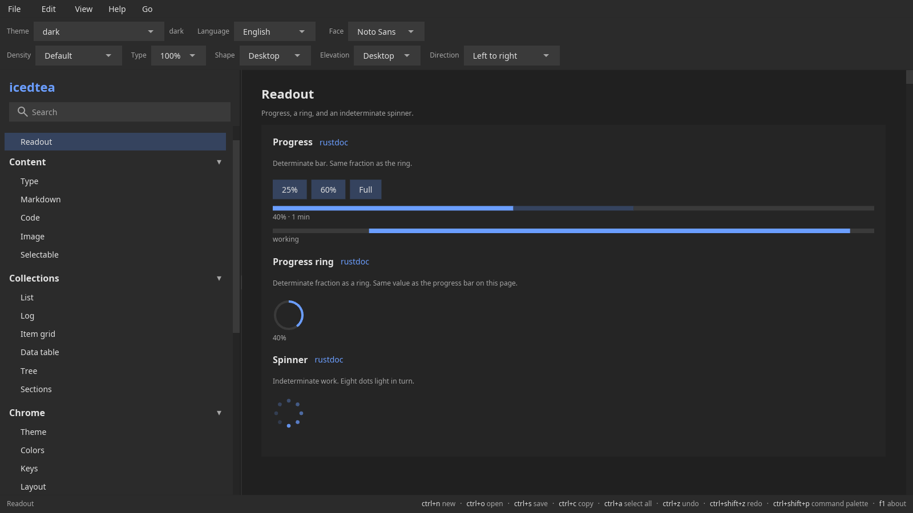

# Readout

Progress, sparks, and a large reading.
[rustdoc](https://docs.rs/icedtea/latest/icedtea/widget/index.html) ·
[source](https://github.com/indynull/icedtea/blob/master/src/widget.rs) ·
[icedtea](https://crates.io/crates/icedtea) ·
[iced](https://crates.io/crates/iced)

Each constructor takes `A11y` unless noted. iced 0.14 publishes the widget id only.

### Progress

**`progress`** — A determinate bar from 0 to 1.

Constructor: [`widget::progress`](https://docs.rs/icedtea/latest/icedtea/widget/fn.progress.html)

[source](https://github.com/indynull/icedtea/blob/master/src/widget.rs) ·
[icedtea](https://crates.io/crates/icedtea) ·
[iced](https://crates.io/crates/iced)

Pass the painted fraction. Interpolate it with
`motion::value_animation` so the fill eases when the target changes.
Optional buffer is a second fill on the same track.
`indeterminate` paints a traveling chunk; pass a looping phase
(0..=1) as `value`. Reduced motion holds that chunk still.
`progress_label` builds the remaining-time copy. Values outside 0..=1
clamp. No message; it is a readout.

Pass `A11y`.

### Progress ring

**`progress-ring`** — A determinate arc from 0 to 1.

Constructor: [`widget::progress_ring`](https://docs.rs/icedtea/latest/icedtea/widget/fn.progress_ring.html)

[source](https://github.com/indynull/icedtea/blob/master/src/widget.rs) ·
[icedtea](https://crates.io/crates/icedtea) ·
[iced](https://crates.io/crates/iced)

Same fraction contract as the bar, drawn as a ring. Interpolate
`value` with `motion::value_animation`.

Pass `A11y`.

### Spinner

**`spinner`** — Eight dots around a circle. Phase lights them in turn.

Constructor: [`widget::spinner`](https://docs.rs/icedtea/latest/icedtea/widget/fn.spinner.html)

[source](https://github.com/indynull/icedtea/blob/master/src/widget.rs) ·
[icedtea](https://crates.io/crates/icedtea) ·
[iced](https://crates.io/crates/iced)

`phase` is 0..=1 and comes from application time. Advance it each
frame while work is running.

Pass `A11y`.

